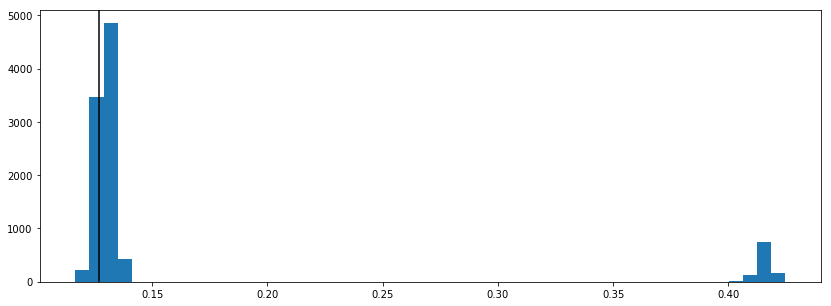
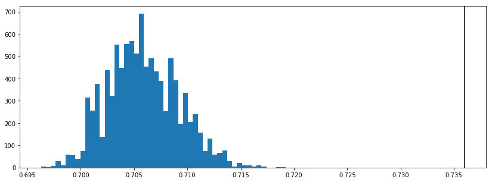
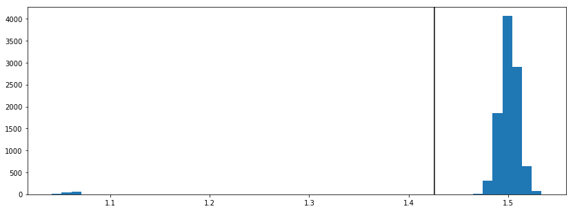
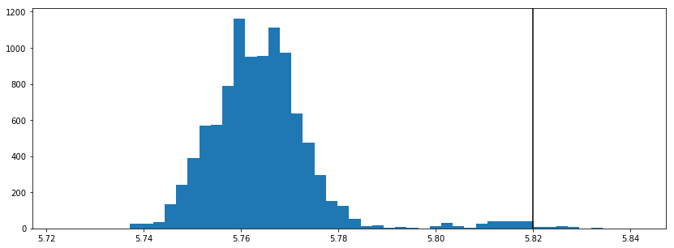

Getting started
===============

.. code:: python

    import blendz

The simplest way to use ``blendz`` is to create a ``Photoz`` object.

.. code:: python

    join(blendz.RESOURCE_PATH, 'data/bpz/UDFtest.cat')

.. parsed-literal::

    '/home/dan/anaconda2/lib/python2.7/site-packages/blendz/resources/data/bpz/UDFtest.cat'

.. code:: python

    from os.path import join

    pz = blendz.Photoz(data_path=join(blendz.RESOURCE_PATH, 'data/bpz/UDFtest.cat'),
                       mag_cols = [1, 3, 5, 7, 9, 11],
                       sigma_cols = [2, 4, 6, 8, 10, 12],
                       #####################################################################
                       #Settings in here shouldn't be necessary - remove them
                       filter_file_extension='.res',
                       spec_z_col=13,
                       #####################################################################
                       ref_band = 2, ref_mag_lo = 20, ref_mag_hi = 32,
                       zero_point_errors = [0.01, 0.01, 0.01, 0.01, 0.01, 0.01],
                       filters=['HST_ACS_WFC_F435W', 'HST_ACS_WFC_F606W', 'HST_ACS_WFC_F775W', \
                                'HST_ACS_WFC_F850LP', 'nic3_f110w', 'nic3_f160w'])

Sample from the single component posterior:

.. code:: python

    pz.sample(1, resample=10000)

.. parsed-literal::

    [Gal: 4/4, Comp: 1/1, Itr: 1800] : 100%|██████████| 4/4 [00:38<00:00,  9.59s/it]

Plot the result:

.. code:: python

    %matplotlib inline
    from matplotlib import pyplot as plt

    for g in range(pz.num_galaxies):
        plt.figure(figsize=(14, 5))
        plt.hist(pz.reweighted_samples[g][1][:, 0], bins=50)
        plt.axvline(pz.photometry[g].spec_redshift, color='k')

